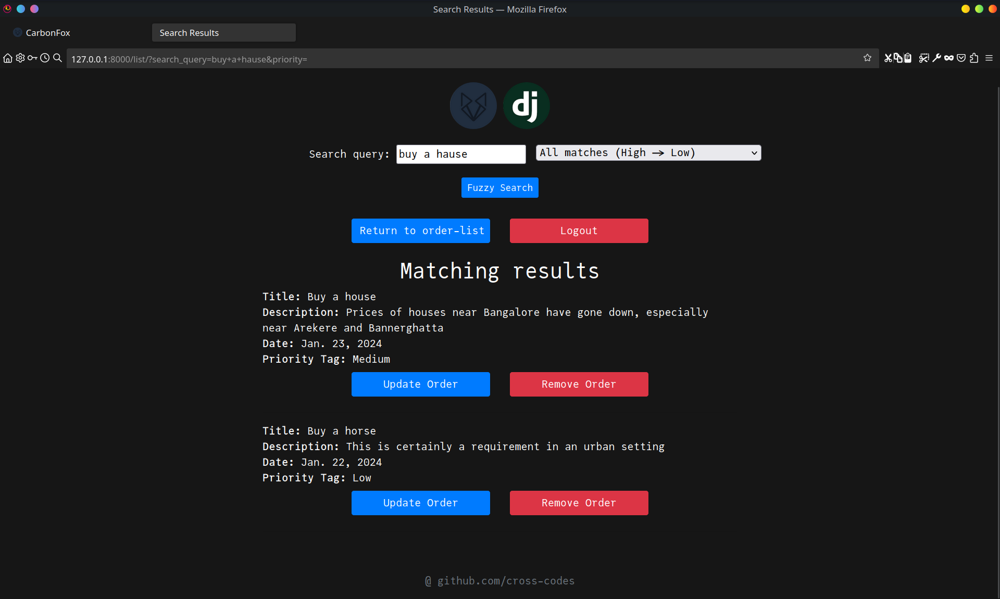
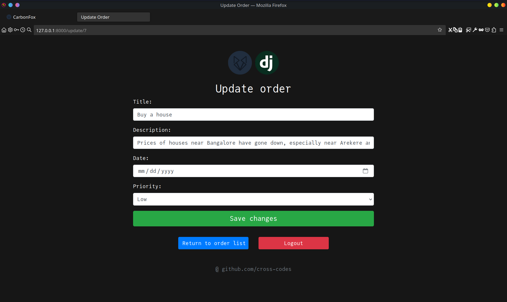
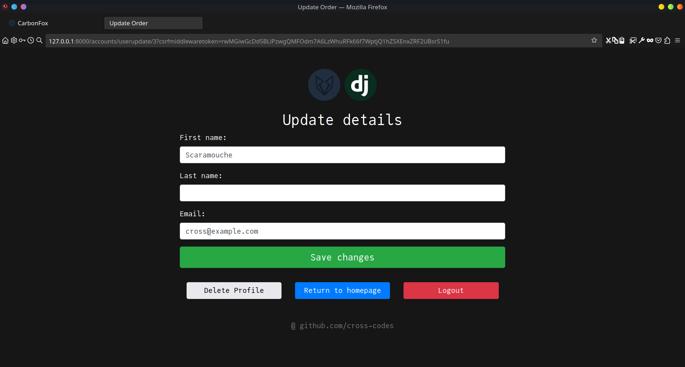

<div align="center">
<h1>Order Management System v1.0</h1>

An order management web application that handles order creation and updation per user


Current version : 1.0

Project done as a task for recruitments into the GDSC's Backend - Web development
division
</div>

---

# Usage

After cloning the repository run the following command in a `venv` or on your
global python environment
in a directory containing the `requirements.txt` file:

```zsh
pip install -r requirements.txt
```

to install all the necessary modules

Switch to the `order_management` project:

```zsh
cd order_management
```

and because this website uses the `sqlite3` database, make the necessary
migrations using

```zsh
python manage.py migrate
```

(If you intend to use a more scalable database like PostgreSQL or MariaDB,
modify the `wgsi.py` and `settings.py` files accordingly)

To start the server, type:

```zsh
python manage.py runserver
```

and then visit [localhost at port 8000](http://127.0.0.1:8000/) to view the website

## Note

(1) The fuzzy search implementation uses the `fuzzywuzzy` library along with `Levenshtein`
to select matching orders. By default, the orders are chosen if the partial ratio is more
than 75%, and then additionally are sorted from high to low priority.

If you wish to modify the partial ratio threshold, update the `fuzz_pratio_threshold` variable
inside the `list_orders` view within the file `📁 order_management/orders/views.py`:

```python
@login_required
def list_orders(request):
    orders = Order.objects.filter(user=request.user)
    search_form = OrderSearchForm(request.GET)
    fuzz_pratio_threshold = 75 # Update this value

    ...
```

For example, if you want a one-to-one string match, set the variable to `100`

(2) The `settings.py` file has `DEBUG=True`, so if you wish to use a production
server, set this to `False`. However, in doing so, the static files at
`📁 order_management/static` will NOT be served,
so consider configuring your `nginx` or `caddy` server to serve these correctly.
Alternatively, consider using the `whitenoise` library if you do not want to
configure a separate server.

---

# Images

<details><summary><b>Images (Click to Expand)</b></summary>

Sign in page:


Home page on successful sign in:


Order list page:


Fuzzy search result:



Updation form:



User updation form:



</details>

---
Project started on: 23/10/2023

(v1.0) First functional version completed on: 27/10/2023
